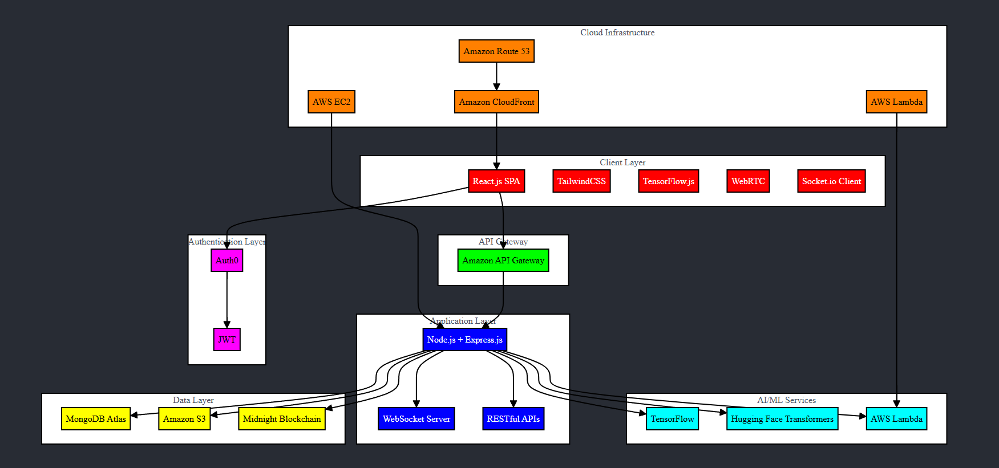

# Personalized Digital Social Coach for Autism

## Table of Contents
1. [Project Overview](#project-overview)
2. [Features](#features)
3. [Architecture](#architecture)
4. [Technology Stack](#technology-stack)
5. [Getting Started](#getting-started)
6. [Usage](#usage)
7. [Contributing](#contributing)
8. [License](#license)

## Project Overview

The Personalized Digital Social Coach for Autism is an AI-driven mobile web application designed to help individuals with autism navigate social situations. The app uses computer vision to detect facial expressions and body language, and natural language processing (NLP) to analyze live conversations, providing real-time feedback. This allows users to receive subtle and non-intrusive guidance during interactions, enhancing their social skills, reducing anxiety, and improving confidence.

## Features

- Real-time facial expression detection
- NLP-based conversation analysis
- Personalized feedback and suggestions
- Customizable user interface for accessibility
- Secure user authentication and data encryption
- Progress tracking and historical analysis

## Architecture

The application follows a client-server architecture with additional cloud services for enhanced functionality and security.

Architecture Diagram Description:
- Client: React.js frontend application
- Server: Node.js with Express.js backend
- Database: MongoDB Atlas for user data storage
- Authentication: Auth0 for secure user authentication
- AI Services: TensorFlow.js for facial expression detection, Hugging Face for NLP
- Encryption: Midnight blockchain for sensitive data encryption
- Cloud Services: AWS (EC2, Lambda, S3) for deployment and scalability

Data Flow:
1. User interacts with the React.js frontend
2. Frontend communicates with Node.js backend via RESTful APIs
3. Backend processes requests, interacts with AI services and database
4. Sensitive data is encrypted using Midnight blockchain before storage
5. User authentication is handled by Auth0
6. AI models process facial expressions and conversation data
7. Real-time feedback is sent back to the frontend via WebSockets

## Technology Stack

- Frontend: React.js with TailwindCSS
- Backend: Node.js with Express.js
- Database: MongoDB Atlas
- Authentication: Auth0
- AI/ML: TensorFlow.js, MediaPipe, Hugging Face Transformers
- Encryption: Midnight blockchain
- Deployment: Amazon AWS (EC2, Lambda, S3)

## Getting Started

### Prerequisites

- Node.js (v14 or later)
- npm (v6 or later)
- MongoDB Atlas account
- Auth0 account
- AWS account

### Installation

1. Clone the repository: git clone https://github.com/yourusername/autism-social-coach.git
cd autism-social-coach

2. ## Dependencies

    ### Frontend Dependencies
- react: ^17.0.2
- react-dom: ^17.0.2
- react-router-dom: ^6.2.1
- @auth0/auth0-react: ^1.9.0
- tailwindcss: ^3.0.23
- @tensorflow/tfjs: ^3.13.0
- face-api.js: ^0.22.2
- axios: ^0.26.0
- socket.io-client: ^4.4.1

    ### Backend Dependencies
- express: ^4.17.3
- mongoose: ^6.2.4
- dotenv: ^16.0.0
- cors: ^2.8.5
- jsonwebtoken: ^8.5.1
- @tensorflow/tfjs-node: ^3.13.0
- @huggingface/inference: ^1.5.1
- socket.io: ^4.4.1
- aws-sdk: ^2.1087.0

    ### Development Dependencies
- nodemon: ^2.0.15
- jest: ^27.5.1
- supertest: ^6.2.2
- @testing-library/react: ^12.1.3
- @testing-library/jest-dom: ^5.16.2

3. Set up environment variables:
Create a `.env` file in the root directory and add the following:

MONGODB_URI=your_mongodb_uri
AUTH0_DOMAIN=your_auth0_domain
AUTH0_CLIENT_ID=your_auth0_client_id
AUTH0_CLIENT_SECRET=your_auth0_client_secret
MIDNIGHT_API_KEY=your_midnight_api_key
AWS_ACCESS_KEY_ID=your_aws_access_key
AWS_SECRET_ACCESS_KEY=your_aws_secret_key

4. Start the development server: npm run dev

## Usage

1. Open the application in a mobile browser or on a desktop (http://localhost:3000 by default).
2. Sign up or log in using Auth0 authentication.
3. Grant necessary permissions for camera and microphone access.
4. Use the app to analyze facial expressions and conversations in real-time.
5. Receive personalized feedback and suggestions for social interactions.

## Contributing

We welcome contributions to the Personalized Digital Social Coach for Autism project. Please read our [CONTRIBUTING.md](CONTRIBUTING.md) file for details on our code of conduct and the process for submitting pull requests.

## License

This project is licensed under the MIT License - see the [LICENSE.md](LICENSE.md) file for details.